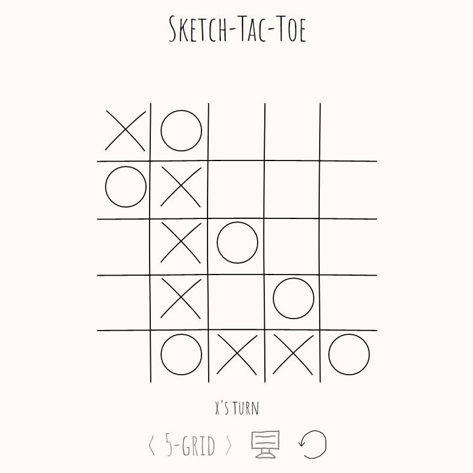

# SketchTacToe-App

SketchTacToe is a responsive vanilla JavaScript implementation of tic-tac-toe with doodle graphics and a computerized opponent algorithm that I built in 2 days. The game is organized around an MVC pattern, with pure HTML elements being updated by render functions as state changes.

# How to Run

Simply download or clone the code and click on `index.html`! This game has been tested successfully on Firefox, Chrome, and Edge.

# The Algorithm

When you select singleplayer mode, the algorithm selects a "line" (row, column, or diagonal) based on programmed preferences, and then finds a free space within that line to place a mark. The "line" is selected based on the following:

1. Find a line with either 3, 2, or 1 spaces filled with marks
2. If the player is about to win on this line, block their move. The probability that this occurs can be lowered to make the computerized opponent "weaker".
3. Otherwise, attempt to build own line
4. Otherwise, if the player is not about to win, block their move.
5. If none of these conditions can be met, place mark in a random space.

